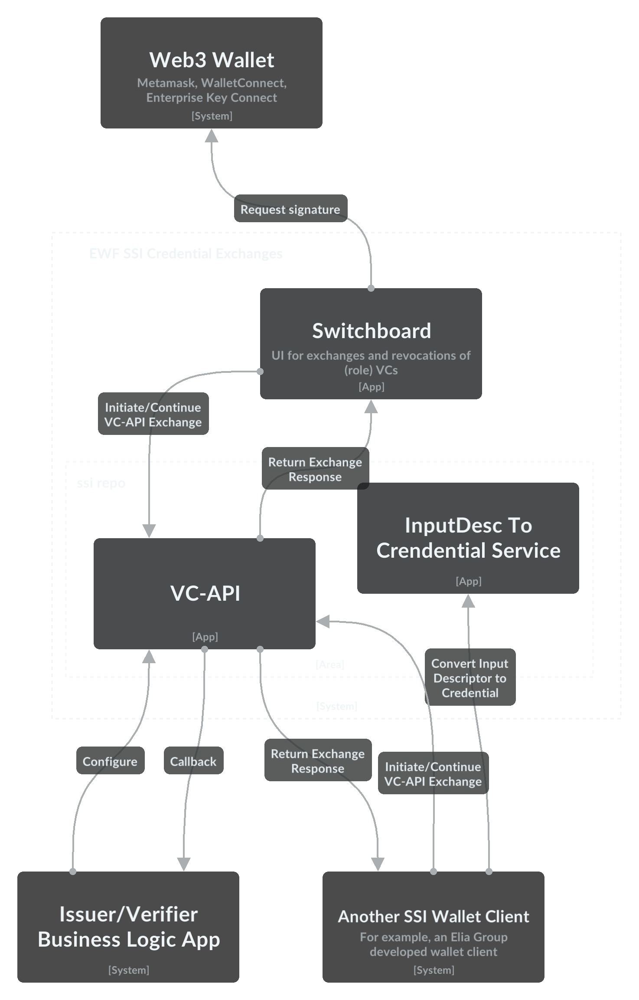

<p align="center">
  <a href="https://www.energyweb.org" target="blank"></a>
  <a href="https://www.eliagroup.com/" target="blank"></a>
</p>


# EWF and Elia Group Self-Sovereign-Identity (SSI) Wallet Components

[](https://github.com/energywebfoundation/ssi/actions/workflows/main.yml)

## Introduction
This repository provides *sample* Self-Sovereign-Identity (SSI) wallet components and libraries.
These are currently provided for demonstration and proof-of-concept purposes.
The functionality is mostly generic functionality based on cryptography and SSI standards,
however the intention is that it can be used to enable more specific energy industry use cases.

These SSI wallet components are a part of the [Energy Web Decentralized Operating System](#ew-dos).
For more information about SSI at EWF, see the [EWF Gitbook page on SSI](https://energy-web-foundation.gitbook.io/energy-web/foundational-concepts/self-sovereign-identity).

## Architecture

### Container Diagram

The following is a C4 Container diagram of the apps within this repository as well as related apps such as [Switchboard](#switchboard).
The diagram was generated used [EnergyWeb's IcePanel](https://s.icepanel.io/gODPIqAQio/-/-/q8qxi31rvqe/g5rxwbzt0c7/342.1/288.7/0.438). 

Note that several of these apps (e.g. Switchboard, Web3 Wallet, SSI Wallet Client) are not in this repository.
They are shown on the diagram for context on how the apps in this repository can be used.
See the [other apps/components](#other-appscomponents) section for more details on some of these other apps. 

The diagram shows that multiple apps (Switchboard, an Elia developed apps or other apps) could act as clients to [VC-API](#vc-api).
In addition, these same client app could work with other VC-API implementions.
This interoperability is made possible through conformance to the [VC-API specification](https://w3c-ccg.github.io/vc-api).



### Apps
#### VC-API
The [vc-api app](./apps/vc-api) is a NestJs implementation of the [W3C Credentials Community Group](https://w3c-ccg.github.io/) [VC API Specification](https://w3c-ccg.github.io/vc-api).

### Libraries
#### DID Library
The DID generation logic is encapsulated in the [did](./libraries/did) library.
This potentially allows the logic to be shared between wallets of various form-factors (e.g. nodejs wallet, a web wallet, another nodejs framework, etc in the future).

Often DID generation requires the generation of a new public-private keypair.
In order to rename agnostic to the key-generation and storage preferences of a particular wallet implementation, the [did](./libraries/did) DID factories accept public keys in the standard format of JWK.

An abstracted process of creating a DID controlled by a asymmetric key-pair is therefore:
```javascript
const key = generateKey(); // Generate a key pair and return the public key necessary to create the DID
const did = generateDID(key); // Code from ssi-did lib. Returns initial DID Document of DID, including Verification Methods
```

#### KMS Interface

### Other apps/components

### Switchboard

[Switchboard](https://github.com/energywebfoundation/switchboard-dapp) can be used as a UI to initiate and continue a VC-API exchange.
It uses [iam-client-lib](#iam-client-lib) to accomplish this.

### iam-client-lib
[iam-client-lib](https://github.com/energywebfoundation/iam-client-lib/) provides SSI related functions such as interaction with EWF's Switchboard role credential definitions, credential request and issuance and connection to the ssi-hub.
It can be used as a client library to this vc-api (for example, to start an exchange).

### ssi-hub
[ssi-hub](https://github.com/energywebfoundation/ssi-hub)'s persistence of issued credentials, requested credentials and DID relationships could be integrated with the code in this repository.

### ew-did-registry
[ew-did-registry](https://github.com/energywebfoundation/ew-did-registry) provides ssi related libraries written by Energy Web.
As such, there is currently some overlap between ew-did-registry libraries and the code in this repository.
For example:
- The DID creation code in the DID library could provided by ew-did-registry
- [ew-did-registry credential-interface](https://github.com/energywebfoundation/ew-did-registry/tree/development/packages/credentials-interface) provides interfaces with could be used within this repository

The overlap was created due to the prototyping nature of this repository and will be reduced in the future.

## Technology Decisions
### Rationale for Spruce DIDKit
Spruce's DIDKit is used for DID generation and credential issuance & verification.
The rational for DIDKit's use is that it:
- Is written in Rust and so suitable for use in any mobile app development framework
- Supports JSON-LD and JWT credential issuance and verification
- Supports did:key, did:ethr, did:web
- DIDKit (and its libraries) are open-source

## Installation
This repository is a monorepo that uses [Rush](https://rushjs.io/) with the PNPM package manager.

PNPM is used for its speed and solution to NPM doppelgangers (as well as being the default option for rush).
See comparison of [NPM vs PNPM vs Yarn for Rush](https://rushjs.io/pages/maintainer/package_managers/).

### Requirements

PNPM is required. See installation instructions here: https://pnpm.js.org/installation/

Rush is required. See installation instructions here: https://rushjs.io/pages/intro/get_started/

### Install

Use rush to install dependencies (not the package manager directly).
In other words, do not run `npm install` or `pnpm install`.
This is because [Rush optimizes](https://rushjs.io/pages/developer/new_developer/) by installing all of the dependency packages in a central folder, and then uses symlinks to create the “node_modules” folder for each of the projects.

```sh
$ rush install
```

### Build

Use rush to build.

```sh
$ rush build
```

## Testing
To run tests across all apps and libraries in one command, a rush script has been added to `./common/config/rush/command-line.json` 
``` sh
$ rush test
```

## Multiple database engines support
VC-API backend supports:
- in-memory SQLite (default)
- SQLite persisted in a file
- Postgres (needs to be started separately)

### In-memory SQLite
**This mode is not intended to be used by multiple load balanced VC-API service instances.**

This is the default mode of operation. The database in this mode is purged and initiated everytime process is started.
No special
steps are required when upgrading versions of the VP-API. Every instance of the VC-API uses its own instance of this
database. 

Start your local VC-API instance with the following:
```shell
$ cd apps/vc-api
$ npm run start:dev
```

### SQLite
**This mode is not intended to be used by multiple load balanced VC-API service instances.**

To activate data persistence for SQLite, set the following env variables:
```dotenv
DB_TYPE=SQLITE
SQLITE_FILE=<path/to/your/file/sqlite.db>
```

Start the VC-API:
```shell
$ cd apps/vc-api
$ npm run start:dev
```

### Postgres
To use Postgres database, start your local postgres server, for example with docker and `docker-compose.full.yaml` 
located in the `apps/vc-api` folder:
```shell
$ cd apps/vc-api
$ docker compose -f docker-compose.full.yaml up
```

Set the following env variables:
```dotenv
DB_TYPE=POSTGRES
POSTGRES_DB_HOST=127.0.0.1
POSTGRES_DB_PORT=5432
POSTGRES_DB_USER=postgres
POSTGRES_DB_PASSWORD=postgres
POSTGRES_DB_NAME=vc-api
```

Start the VC-API:
```shell
$ cd apps/vc-api
$ npm run start:dev
```

## Database migrations

Having database persisted on production makes it necessary to have database schema migration process in place when 
upgrading VC-API version running. Thanks to the migrations feature of the TypeORM this can bed automated.

### Executing migrations after VC-API code updated

#### WARNING!!!

The following settings are reccomended on production. These are also default application settings if not provided:
```dotenv
# below, if set to `true`, erases all data on every application start
DB_DROP_ON_START=false
# below is intended to be set to `true` only when developing locally
DB_SYNCHRONIZE=false
```

Execution of the database schema migrations is automated, so that only required migrations are executed to upgrade the 
database schema. This can be done in two ways:

#### By the application

A VC-API service is able to execute migrations by itself when starting. To enable this feature the following env 
variable is needed:
```dotenv
DB_RUN_MIGRATIONS=true
```

#### With npm script

If you decide to disable execution of migrations by application, they can be executed manually:
```shell
$ cd apps/vc-api
$ npm run migration:run
```

### Creating new migrations after development

The reccommended settings for development are:
```dotenv
DB_DROP_ON_START=true
DB_SYNCHRONIZE=true
DB_RUN_MIGRATIONS=true
```

This means that database schema will be dropped on every application restart, migrations executed and all entities 
changes not reflected in migrations will be synchronised to the DB schema. This allows faster development.

After completing chunk of work, for example when preparing a pull request to be reviewed and merged, another db 
schema migration needs to be created and committed.

**Warning!** Two sets of migrations need to be added. For SQLite and Postgres.

To create migrations, you will need to:

1. [drop db schemas](#dropping-schemas) for both Postgres and SQLite
2. stop your application instances if running
3. ensure your `.env` file contains valid settings for both Postgres and SQLite persisted in file
4. [execute](#executing-existing-migrations) existing migrations
5. [generate](#generating-new-migration-files) migration files
6. validate migration files
7. commit migration files

#### Dropping schemas
1. Remove your SQLite file. By default, it should be `apps/vc-api/sqlite.db`.
2. Start your Postgres instance from scratch. If you started it with `docker compose -f docker-compose.full.yaml up` 
execute the following:
    ```shell
    $ cd apps/vc-api
    $ docker compose -f docker-compose.full.yaml down -v
    ```
    `-v` means volumes are to be removed - **this is important option here**

#### Executing existing migrations
```shell
$ npm run migration:run:pg
```
```shell
$ npm run migration:run:sqlite
```

#### Generating new migration files
```shell
npm run migration:generate:pg <migration-name>
```
this should add a new migration file for Postgres to the `apps/vc-api/src/migrations/pg` folder

and
```shell
npm run migration:generate:sqlite <migration-name>
```

this should add a new migration file for SQLite to the `apps/vc-api/src/migrations/sqlite` folder

#### Warning
Migrations are executed in order of files sorted by name. Migration files start with a timestamp, for instance 
`1671212337326-initial.ts`. If you are planning to merge your PR to the base branch, keep in mind that in some 
situations you will need to delete and regenerate your migrations again to keep them in order with migrations added 
in meantime to the base branch.

## Contributing Guidelines 
See [contributing.md](./contributing.md)

## Questions and Support
For questions and support please use the Github issues.

## EW-DOS
The Energy Web Decentralized Operating System is a blockchain-based, multi-layer digital infrastructure. 

The purpose of EW-DOS is to develop and deploy an open and decentralized digital operating system for the energy sector in support of a low-carbon, customer-centric energy future. 

We develop blockchain technology, full-stack applications and middleware packages that facilitate participation of Distributed Energy Resources on the grid and create open market places for transparent and efficient renewable energy trading.

- To learn about more about the EW-DOS tech stack, see our [documentation](https://app.gitbook.com/@energy-web-foundation/s/energy-web/).  

- For an overview of the energy-sector challenges our use cases address, go [here](https://app.gitbook.com/@energy-web-foundation/s/energy-web/our-mission). 

For a deep-dive into the motivation and methodology behind our technical solutions, we encourage you to read our White Papers:

- [Energy Web White Paper on Vision and Purpose](https://www.energyweb.org/reports/EWDOS-Vision-Purpose/)
- [Energy Web  White Paper on Technology Detail](https://www.energyweb.org/wp-content/uploads/2020/06/EnergyWeb-EWDOS-PART2-TechnologyDetail-202006-vFinal.pdf)


## Connect with Energy Web
- [Twitter](https://twitter.com/energywebx)
- [Discord](https://discord.com/channels/706103009205288990/843970822254362664)
- [Telegram](https://t.me/energyweb)

## License

This project is licensed under the GNU General Public License v3.0 or later - see the [LICENSE](LICENSE) file for details

